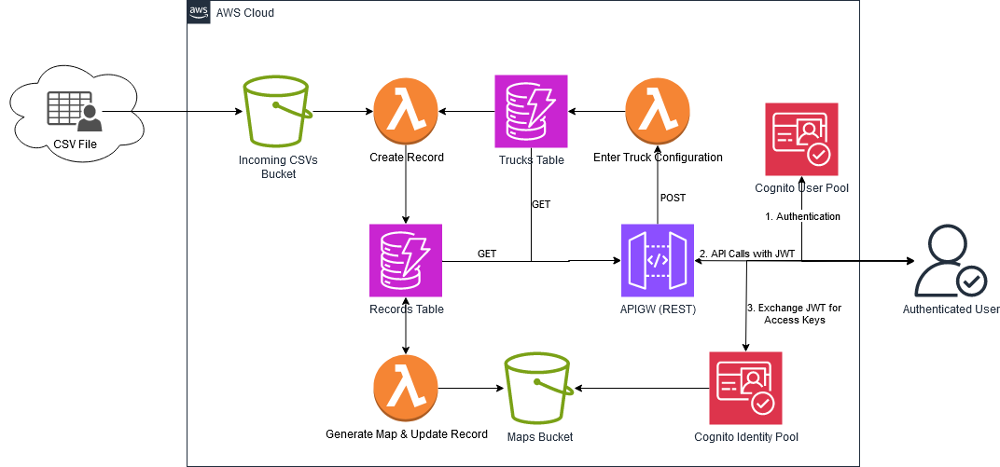

# Welcome to the Runlog CDK project!

This app tracks test records for a fleet of trucks based on incoming CSV files. 
Trucks configurations and test records are stored in DDB tables. 
As soon as a CSV file is uploaded into the IncomingCsv S3 bucket, Lambda function is invoked. 
The first Lambda function creates a test record in Records DDB table. 
As soon as the record is created, the second Lambda generates a map from coordinates 
in the CSV file, saves into the Maps S3 bucket, and adds the file name into the records table.
User authentication is handled by Cognito User Pool.

### Workflow Diagram


The app consists of the following components:

### CognitoStack (cognito_stack.py)

This stack sets up a Cognito User Pool and Identity Pool to manage user authentication and authorization. The resources created in this stack are:
- Cognito User Pool: A user pool for user registration, sign-in, and other authentication-related tasks. The pool is configured to allow self-sign-up, email verification, and user alias support (email/username).
- Cognito User Pool Client: A client application associated with the user pool to facilitate user interactions with the app. The client supports various authentication flows, including user-password and Secure Remote Password (SRP).
- Cognito Identity Pool: An identity pool that allows authenticated users to access other AWS services securely. An IAM role with read-only access to an S3 bucket is associated with authenticated users.

#### Outputs:
- UserPoolId: The ID of the Cognito User Pool.
- UserPoolClientId: The ID of the Cognito User Pool Client.
- IdentityPoolId: The ID of the Cognito Identity Pool.

### TrucksDdbStack (truck_ddb_stack.py)

This stack creates a DynamoDB table to store truck records and a Lambda function responsible for putting truck records in the table. The resources created in this stack are:

- DynamoDB Table: A table named "TrucksTable" with "currentVin" as the partition key to store truck records.
- Lambda Function: The "EnterTruckLambda" function, which is triggered by an API Gateway and responsible for inserting truck records into the DynamoDB table.
- IAM Role: An IAM role associated with the Lambda function, granting permission to write data to the "TrucksTable."

#### Outputs:
- TrucksTableARN: The ARN of the Trucks DynamoDB table.
- AddTruckLambdaARN: The ARN of the Lambda function responsible for adding truck records.

## RecordsDdbStack (records_ddb_stack.py)

This stack creates a DynamoDB table to store records data and a Lambda function that processes CSV files and puts the data into the table. The resources created in this stack are:

- DynamoDB Table: A table named "RecordsTable" with "filename" as the partition key to store record data.
- Lambda Function: The "CsvLambda" function, triggered by an S3 bucket when new CSV files are uploaded. It processes the CSV files and inserts the data into the "RecordsTable."
- S3 Bucket: An S3 bucket named "incomingcsvs-" configured to send notifications to the "CsvLambda" function when new CSV files are uploaded.
- S3 Bucket: An S3 bucket named "maps-" to store generated maps by the "MapsLambda" function.
- Lambda Layer: A Lambda layer containing Pandas and Folium libraries to be used by the "MapsLambda" function.

#### Outputs:

- CsvBucketName: The name of the S3 bucket for incoming CSV files.
- MapsBucketName: The name of the S3 bucket for storing generated maps.

## RestApiGWStack (apigw_stack.py)

This stack creates an API Gateway and defines various API methods that allow users to interact with the system. The resources created in this stack are:

- API Gateway: An API Gateway named "RunlogRestApi" that serves as the entry point for RESTful API requests.
- Cognito User Pools Authorizer: An authorizer using Cognito User Pools to handle user authentication for the API.
- Models: API models used to validate request payloads for specific API methods.
- API Methods:
    - POST /addtruck: A method to add truck records to the "TrucksTable" using the "EnterTruckLambda" function.
    - GET /alltrucks: A method to retrieve all truck records from the "TrucksTable."
    - GET /allrecords: A method to retrieve all records from the "RecordsTable."

Note: The API methods interact with the DynamoDB tables using an IAM role with read access to the "TrucksTable" and "RecordsTable."

## Application (app.py)

This is the main application file that orchestrates the deployment of all the defined stacks. It sets up dependencies between the stacks and deploys them using the AWS CDK App object.

## Additional Files

The app also includes several other Python files, including Lambda functions (csv_lambda, maps_lambda, trucksdb_lambda) and templates for processing data. These files are used to implement the business logic and integration with other AWS services.

## Prerequisites

Before deploying this stack, you need the following prerequisites:

1. AWS CLI installed and configured with appropriate credentials.
2. Node.js installed, as the AWS CDK is built on Node.js.
3. Python3 installed.

## Description
### Stacks Diagram


## Deployment steps
To manually create a virtualenv on MacOS and Linux:

### inside the ```runlog``` directory
```
$ python3 -m venv .venv
```

After the init process completes and the virtualenv is created, you can use the following
step to activate your virtualenv.

```
$ source .venv/bin/activate
```

If you are a Windows platform, you would activate the virtualenv like this:

```
% .venv\Scripts\activate.bat
```

Once the virtualenv is activated, you can install the required dependencies.

```
$ pip install -r requirements.txt
```

At this point you can now synthesize the CloudFormation template for this code.

```
$ cdk synth
```

Configure the AWS credentials for the profile you want to use and run

```
$ cdk deploy --all
```

to skip approvals for each stack run

```
$ cdk deploy --all --require-approval=never
```

## Usage

Once the app is deployed, populate all the values in the ```variables.py``` file

1. Run ```createuser.py``` to create a user in the Cognito User Pool
 - all API calls require a JWT of the user authenticated with CUP
2. Run ```addtruck.py``` to create a truck configuration entry
3. Run ```alltrucks.py``` to list all truck configurations
4. Upload the CSV files into the ```IncomingCsvs``` bucket
5. Run ```allrecords.py``` to retrieve the created records
6. Run ```getmap.py``` to retrieve maps